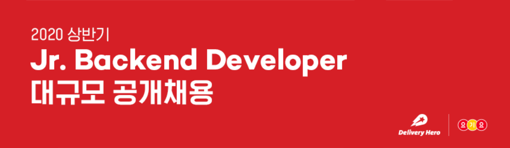
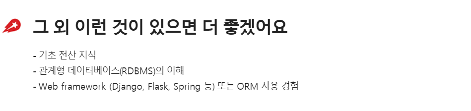

# 딜리버리히어로 코리아 2020 상반기 채용

### 0. 정리에 앞서..

- 주니어 개발자 채용은 만 1년경력 이상의 분들에게만 열려있다는 연락을 받았다..
- SSAFY를 Job Fair도 참가하는 기업으로 알고있는데 그 때 내가 올해 지원할 수 있는 방법이 있을지 여쭤보고 없다면 내년 상반기부터 노릴 수 있을 것 같다.

### 1. 공고 분석

> 공고가 대체로 비슷하다. 하나하나 분석해보자.

- 회사의 문화가 나랑 정말 잘 맞을 것 같다.
  - 글로벌 문화 지향!
  - 내가 만든 서비스를 사람들이 이용하는 모습을 볼 수 있다..!
  - 높은 성장률을 보이고, 도전적으로 경험할 수 있는 곳!

- 만 1년 이상의 개발경험은 없지만, 현재 SSAFY에서 하고있는 Python과 Django Framework를 이용한 프로젝트들로 기본기를 탄탄히 할 수 있었다.
- 앞으로 진행할 프로젝트들 또한 잘 정리해서 Github, 포트폴리오 등 잘 준비하자.

- 전산 지식 : 6/6 정보처리기사
- RDBMS : Django에서 SQLite 한 내용을 바탕으로 SQLD 등 자격증 알아볼 것!
- Framework Django 공부 꾸준히 하고 Flask공부도 해보자!

